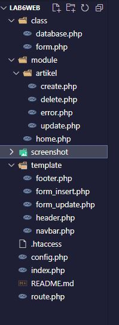

# Praktikum 6: PHP OOP lanjutan
# Tugas Pemograman Web 2
## Profil
| #               | Biodata           |
| --------------- | ----------------- |
| **Nama**        | NAFAL MUMTAZ FUADI |
| **NIM**         | 312110457       |
| **Kelas**       | TI.21.A.2         |
| **Mata Kuliah** | Pemrograman Web 2 |


## **Directory Path**



<br/><br/>

## **Directory Tree**

```bash
Lab6Web
│
├───.htaccess
├───config.php
├───index.php
├───README.md
├───route.php
│
├───class
│    ├───database.php
│    └───form.php
│
├───module
│    ├───home.php
│    └───artikel
│        ├───create.php
│        ├───delete.php
│        ├───error.php
│        └───update.php
│
├───screenshot
│    └───directory.JPG
│
└───template
     ├───footer.php
     ├───form_insert.php
     ├───form_update.php
     ├───header.php
     └───navbar.php
```
